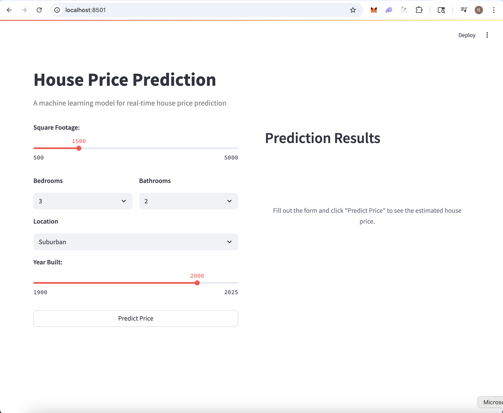
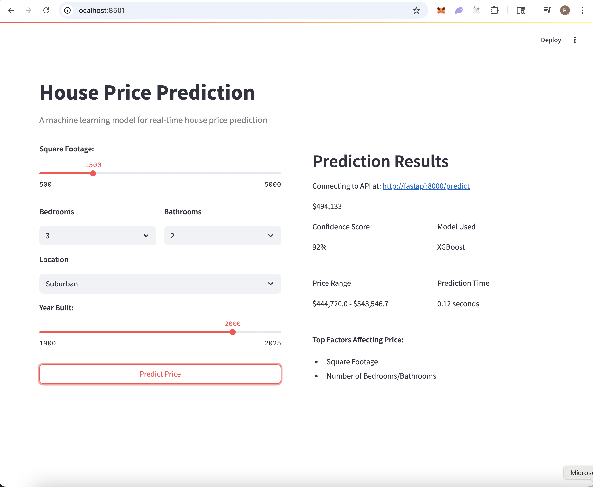

# 🏠 House Price Predictor

Welcome to the **House Price Predictor** project! This is a real-world, end-to-end machine learning application that predicts house prices based on various features.

## 🎯 Problems Solved

- **Accurate Price Prediction**: Uses machine learning to predict house prices based on features like size, location, and condition
- **Data Quality**: Handles missing data, outliers, and inconsistencies in raw housing data
- **Scalable Deployment**: Provides production-ready API and web interface for real-time predictions
- **Model Tracking**: Ensures reproducibility and version control of ML experiments
- **User-Friendly Interface**: Offers both API and web-based access for different user needs

## 🔧 Tech Stack

- **Machine Learning**: Python, scikit-learn, pandas, numpy
- **Model Tracking**: MLflow with Docker containerization
- **API Development**: FastAPI for high-performance REST API
- **Web Interface**: Streamlit for interactive predictions
- **Development Tools**: UV (package manager), Git, Docker/Podman
- **Kubernetes**: Local development cluster with Kind
- **Experiment Tools**: JupyterLab (optional)

You'll start from raw data and move through data preprocessing, feature engineering, experimentation, model tracking with MLflow, and optionally using Jupyter for exploration – all while applying industry-grade tooling.

---

## 📦 Project Structure

```
house-price-predictor/
├── configs/                # YAML-based configuration for models
├── data/                   # Raw and processed datasets
├── deployment/
│   └── mlflow/             # Docker Compose setup for MLflow
├── models/                 # Trained models and preprocessors
├── notebooks/              # Optional Jupyter notebooks for experimentation
├── src/
│   ├── data/               # Data cleaning and preprocessing scripts
│   ├── features/           # Feature engineering pipeline
│   ├── models/             # Model training and evaluation
├── requirements.txt        # Python dependencies
└── README.md               # You’re here!
```

---

## 🛠️ Setting up Learning/Development Environment

To begin, ensure the following tools are installed on your system:

- [Python 3.11](https://www.python.org/downloads/)
- [Git](https://git-scm.com/)
- [Visual Studio Code](https://code.visualstudio.com/) or your preferred editor
- [UV – Python package and environment manager](https://github.com/astral-sh/uv)
- [Docker Desktop](https://www.docker.com/products/docker-desktop/) **or** [Podman Desktop](https://podman-desktop.io/)

---

## 🚀 Preparing Your Environment

1. **Fork this repo** on GitHub.

2. **Clone your forked copy:**

   ```bash
   # Replace xxxxxx with your GitHub username or org
   git clone https://github.com/xxxxxx/house-price-predictor.git
   cd house-price-predictor
   ```

3. **Setup Python Virtual Environment using UV:**

   ```bash
   uv venv --python python3.11
   source .venv/bin/activate
   ```

4. **Install dependencies:**

   ```bash
   uv pip install -r requirements.txt
   ```

---

## 📊 Setup MLflow for Experiment Tracking

To track experiments and model runs:

```bash
cd deployment/mlflow
docker compose -f mlflow-docker-compose.yml up -d
docker compose ps
```

> 🐧 **Using Podman?** Use this instead:

```bash
podman compose -f mlflow-docker-compose.yml up -d
podman compose ps
```

Access the MLflow UI at [http://localhost:5555](http://localhost:5555)

---

## 📒 Using JupyterLab (Optional)

If you prefer an interactive experience, launch JupyterLab with:

```bash
uv python -m jupyterlab
# or
python -m jupyterlab
```

---

## 🔁 Model Workflow

### 🧹 Step 1: Data Processing

Clean and preprocess the raw housing dataset:

```bash
python src/data/run_processing.py   --input data/raw/house_data.csv   --output data/processed/cleaned_house_data.csv
```

---

### 🧠 Step 2: Feature Engineering

Apply transformations and generate features:

```bash
python src/features/engineer.py   --input data/processed/cleaned_house_data.csv   --output data/processed/featured_house_data.csv   --preprocessor models/trained/preprocessor.pkl
```

---

### 📈 Step 3: Modeling & Experimentation

Train your model and log everything to MLflow:

```bash
python src/models/train_model.py   --config configs/model_config.yaml   --data data/processed/featured_house_data.csv   --models-dir models   --mlflow-tracking-uri http://localhost:5555
```

---

## Building FastAPI and Streamlit

The code for both the apps are available in `src/api` and `streamlit_app` already. To build and launch these apps

- Add a `Dockerfile` in the root of the source code for building FastAPI
- Add `streamlit_app/Dockerfile` to package and build the Streamlit app
- Add `docker-compose.yaml` in the root path to launch both these apps. be sure to provide `API_URL=http://fastapi:8000` in the streamlit app's environment.

Once you have launched both the apps, you should be able to access streamlit web ui and make predictions.

You could also test predictions with FastAPI directly using

```
curl -X POST "http://localhost:8000/predict" \
-H "Content-Type: application/json" \
-d '{
  "sqft": 1500,
  "bedrooms": 3,
  "bathrooms": 2,
  "location": "suburban",
  "year_built": 2000,
  "condition": fair
}'

```

Be sure to replace `http://localhost:8000/predict` with actual endpoint based on where its running.

## 🚀 Deployment Journey

1. **Initial Setup & Development**

   - Set up the development environment with Python 3.11 and UV package manager
   - Created virtual environment and installed dependencies
   - Implemented data processing and feature engineering pipelines

2. **Model Development**

   - Set up MLflow for experiment tracking using Docker
   - Trained and evaluated multiple models
   - Selected the best performing model for deployment

3. **API Development**

   - Built FastAPI service for model inference
   - Containerized the API using Docker
   - Implemented input validation and error handling

4. **Frontend Development**

   - Created interactive Streamlit web interface
   - Containerized the frontend application
   - Integrated with FastAPI backend

5. **Container Orchestration**
   - Set up local Kubernetes cluster using Kind
   - Created deployment configurations
   - Configured service networking

## 📸 Application Screenshots

### Streamlit Web Interface




## Contributing

We welcome contributions, issues, and suggestions to make this project even better. Feel free to fork, explore, and raise PRs!
